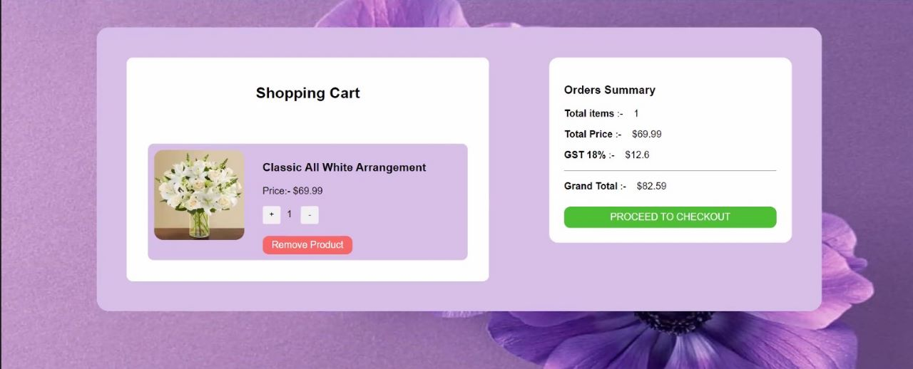
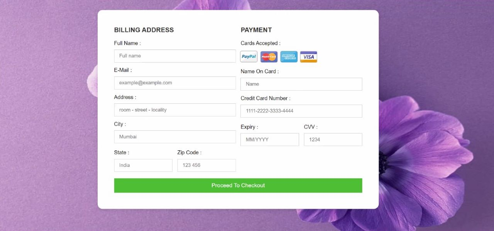
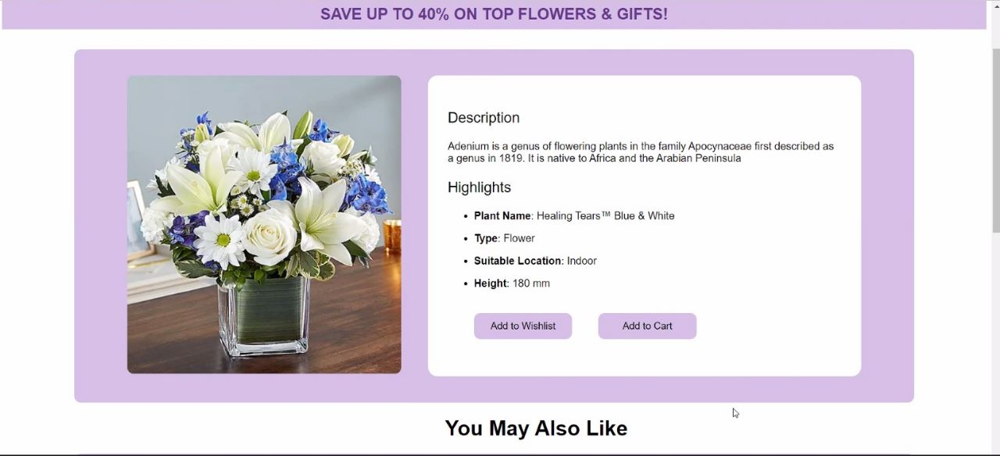
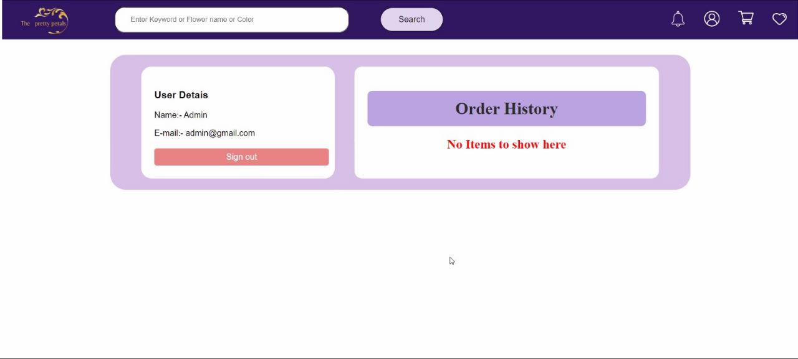

JS 201 CONSTRUCT WEEK PROJECT

# The Pretty petals
# The Pretty Petals_website_photos

This is the photos of the The Pretty Petals website. The Pretty Petals is an online Ecommerce Website which is providing fresh flowers and bouquets. From this website, users can Order fresh flowers and combination of flowers  and much more across the world.

**To see the live site click the below link.**

https://dulcet-figolla-1e3b3e.netlify.app

## Built with
<ul>
 
  <li>HTML</li>
  <li>CSS</li>
  <li>JavaScript</li>
  <li>JSON server</li>
</ul>

## Used libraries
<ul>
  <li>node modules</li>
  <li>Styled-Components</li>
 <li>HTML Components</li>
 <li>Scripts files</li>
 <li>Admin-panel</li>
</ul>

## Features
<ul>
  <li>Signup</li>
  <li>Login</li>
    <li>Sorting</li>
  <li>Individual Item Pages</li>
  <li>Filtering glasses by their Type and category including Men,Women and Kids</li>
  <li>Searching Functionality</li>
  <li>Pagination</li>
</ul>

## Some screenshots of the project

### Thanks for reading
